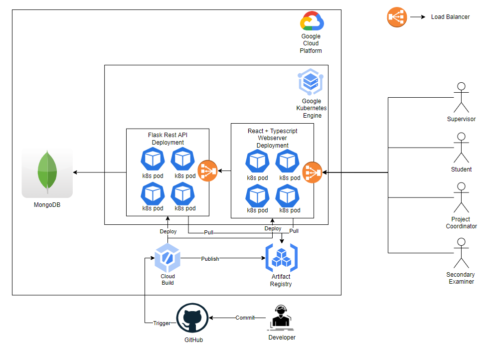

# capstone-frontend

## Description
This is the frontend of the Capstone Project Management System. It is a web application that allows users to create projects, view supervisors and send project proposals.

## Architecture

We use the below tools/technologies to build and run our application:
- **React.JS** - [React.JS](https://reactjs.org/) is used for this project
- **TypeScript** - [TypeScript](https://www.typescriptlang.org/) is used for this project
- **Kubernetes** - [Kubernetes](https://kubernetes.io/) is an open-source orchestration framework used for automating deployment, scaling and management of containerized applications
- **Docker** - [Docker](https://www.docker.com/) is a PAAS product that offers OS-level virtualization through containers
- **Google Kubernetes Engine** - [Google Kubernetes Engine](https://cloud.google.com/kubernetes-engine) is an orchestration system for docker containers
- **Artifact Registry (GCP)** - [Artifact Registry](https://cloud.google.com/artifact-registry) is a registry to store built docker images
- **Cloud Build (GCP)** - [Cloud Build (GCP)](https://cloud.google.com/build) is a serverless ci/cd platform which can be used to build and deploy containers in GKE

This application uses [GKE Autopilot](https://cloud.google.com/kubernetes-engine/docs/concepts/autopilot-overview) which removes the overhead of provisioning nodes for the kubernetes cluster.
It automatically manages, optimizes the nodes, node pools in the kubernetes clusters for both development and production workloads. This reduces a lot of DevOps workload for maintaining the Kubernetes cluster.
The customers only pay for the cpu, memory used.

This application uses [Cloud Build (GCP)](https://cloud.google.com/build) to automatically build and deploy the code into GKE autopilot cluster whenever new commits are pushed to the [GitHub repo](https://github.com/nehabthakur/capstone-frontend) master branch.

We have adopted the [GitOps](https://www.weave.works/technologies/gitops/) methodology of CI/CD to automatically deploy changes once they're developed and tested.
We have created a trigger in Cloud Build that continuously polls the GitHub repo's master branch and looks for [cloudbuild file](cloudbuild.yaml) and runs the following steps. 
Builds the image and pushes it to [Artifact Registry (GCP)](https://cloud.google.com/artifact-registry). 
It will then deploy the kubernetes config files defined in [tools/k8s/gke](tools/k8s/gke) to GKE Autopilot cluster automatically.

## Code

- All the external libraries are defined in [package.json](package.json) 
- All the source code is defined in [src](src)
- The starting point of the application is [src/App.tsx](src/App.tsx)
- [src.common](src/common) contains common services
- [src.components](src/components) contains all the components of the application
- [src.services](src/services) contains all the services of the application
- [src.types](src/types) contains all the types of the application
- [cloudbuild.yaml](cloudbuild.yaml) file consists of the ci/cd steps defined as code
- [tools/docker](tools/docker) directory consists of the Dockerfile which packages the application as a container image
- [tools/k8s](tools/k8s) directory consists of yaml files to run the built container image in kubernetes

## Instructions

### Pre-requisites
* NPM
* Yarn
* React.JS
* TypeScript
* This requires the `capstone-backend` service to be running (See: https://github.com/nehabthakur/capstone-backend)

### Additional Pre-requisites
- [Docker Desktop](https://www.docker.com/products/docker-desktop/)
- [Kubernetes](https://kubernetes.io/releases/download/)

### Additional Pre-requisites for running on cloud
- [Google cloud](https://cloud.google.com/) - Create a Google cloud account, setup billing

### Local
This will run the application directly on the personal machine on port 8081. Below are the steps:

#### Steps
1. Run `npm start` to run the application.
2. Application can be accessed using this [localhost:8081](http://localhost:8081)

### Local Kubernetes
This will run the application using Kubernetes on the personal machine on port 5000. Below are the steps:

#### Steps
1. Build the docker image using `docker build -t capstone-frontend:latest -f tools/docker/Dockerfile .`
2. Deploy image using `kubectl apply -f .\tools\k8s\local\`
3. Application can be accessed using this [localhost:3000](http://localhost:3000)

### GKE
This will run the application using GKE autopilot on google cloud. Below are the steps:

#### Steps
1. Create an [GKE Autopilot](https://console.cloud.google.com/kubernetes/list/overview) Cluster
2. Create a trigger in [Cloud Build](https://console.cloud.google.com/cloud-build/triggers) that triggers a build when a new commit is pushed to the master branch in GitHub
3. Trigger should have the following properties:
   1. Event should be `Push to a branch`
   2. Connect the GitHub Repo and set branch to `^master$`
   3. Configuration should use Cloud Build Configuration file
   4. Location should be Repository and set the configuration file to be `cloudbuild.yaml`
   5. Set the following substitution variables
      1. `_GKE_CLUSTER_ID` -> `<Set the GKE cluster id>`
      2. `_IMAGE` -> `capstone-frontend`
      3. `_LOCATION` -> `<Set the location as per your preference>`
      4. `_REPOSITORY` -> `<Set the Repository Name>`
4. Enable Access to `GKE` in [Cloud Build](https://console.cloud.google.com/cloud-build/settings/service-account) settings
5. Deploy and start the service either by pushing a new commit or running the cloud build trigger [manually](https://console.cloud.google.com/cloud-build/triggers)
6. Access the app by opening the endpoint in `capstone-fronend-service` in [GKE Services Page](https://console.cloud.google.com/kubernetes/discovery)
